<picture>
  <source media="(prefers-color-scheme: dark)" srcset="assets/hero-dark.svg">
  <source media="(prefers-color-scheme: light)" srcset="assets/hero-light.svg">
  
</picture>

**Akash Verma**, SRE & Cloud Architect (in case the fancy banner above didn't load, hi 👋)

## About me

I'm a Site Reliability Engineer and Cloud Architect who has spent 10+ years making sure other people's 3am doesn't happen. I build and run Kubernetes fleets, GPU clusters for AI workloads, and the Terraform/Ansible glue that holds it all together, so things stay up at 99.99% uptime (yes, I counted the nines 🧮). When I'm not on call, I build my own tools instead of waiting for someone else to fix my problems 👀

<picture>
  <source media="(prefers-color-scheme: dark)" srcset="assets/signature-card-dark.svg">
  <source media="(prefers-color-scheme: light)" srcset="assets/signature-card-light.svg">
  
</picture>

## My stack 🧰

  
  
  
  
  
  
  
  
  
  
  
  
  
  

## The numbers GitHub tracks 📈

  

  
  

  
  

<i>when PagerDuty knows I'm awake ⏰</i>

<picture>
  <source media="(prefers-color-scheme: dark)" srcset="https://raw.githubusercontent.com/akash-cloudtech/akash-cloudtech/output/snake-dark.svg">
  <source media="(prefers-color-scheme: light)" srcset="https://raw.githubusercontent.com/akash-cloudtech/akash-cloudtech/output/snake-light.svg">
  
</picture>

## What I've been building 🚀

| Project | What it is | Status | Stack |
|---|---|---|---|
| [🔥 k8s-rizz](https://k8srizz.com) | A terminal dashboard that auto-detects every Kubernetes cluster you're already logged into (GKE, EKS, AKS, K3s, your laptop, all of it) and tells you which namespaces are 🔥 Rizzing and which ones are 💀 Cooked. Zero config, read-only, single binary. | ✅ Live and free (MIT license) | Kubernetes, single binary, multi-cloud |

⭐ [Star it on GitHub](https://github.com/akash-cloudtech/k8s-rizz) if it's ever saved your 3am.

📜 Certifications (yes, they're all real, click to verify)

 

| Certification | Issuer | Status | Verify |
|---|---|---|---|
| Generative AI Leader | Google Cloud | ✅ Active until 2028 | [Credly ↗](https://www.credly.com/badges/231b9e41-8252-4554-8daa-1780e8393e40) |
| Associate Cloud Engineer | Google Cloud | ✅ Active until 2028 | [Credly ↗](https://www.credly.com/badges/1177a2da-fa8f-468e-b745-5fefa088c719) |
| Professional Cloud Architect | Google Cloud | ✅ Active until 2027 | [Credly ↗](https://www.credly.com/badges/34f021b6-0ff4-43cb-9cdf-2246f70b6cc5) |
| GitHub Foundations | GitHub | ✅ Active until 2027 | [Credly ↗](https://www.credly.com/badges/9c33590a-dfe6-45cb-a3dd-d4ad953ab56b) |
| Azure Fundamentals | Microsoft | ✅ Active for life | [Credly ↗](https://www.credly.com/badges/2f11c5fd-5af0-41e7-8139-002929077642) |
| Azure Administrator Associate | Microsoft | 💀 Expired 2023 (the knowledge didn't) | [Credly ↗](https://www.credly.com/badges/e6b52acb-d557-45d5-8450-855c211ed8af) |
| SRE: Measuring and Managing Reliability | Google Cloud | ✅ Active for life | [Coursera ↗](https://coursera.org/verify/BGRJXLP9F643) |

🧰 The rest of the toolbox (the long, boring, but true list)

 

And the enterprise veterans that still run half the internet: WebSphere, WebLogic, JBoss, Nagios, Icinga2, PagerDuty, Opsgenie 😅

## Let's talk 👋

  
  
  
  

  
  
  
  
  
  

<i>akash-cloudtech@sre:~$ echo "thanks for scrolling this far 🫡"</i>

